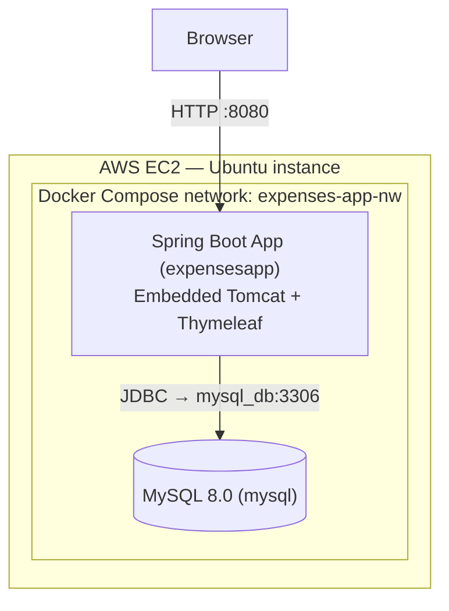

# 💰 Dockerized Expense Tracker — Spring Boot + MySQL on AWS EC2


A full-stack Expense Tracker (Spring Boot + Spring Security + MySQL) containerized with a **multi-stage Docker build** and orchestrated with **Docker Compose**, deployed on AWS EC2.

This is my second Docker project, built specifically to go deeper on two things the first project (a Django Notes App) didn't cover: a real **multi-stage build** to shrink the final image, and a `depends_on` that actually waits on a **healthcheck** instead of just a container starting.

---

## 📐 Architecture



Two services, no reverse proxy: Spring Boot's embedded Tomcat serves HTTP directly on 8080. Compared to project 1's three-tier Nginx → Gunicorn → Django setup, this is a deliberately simpler two-tier shape — useful to be able to explain *why* you'd reach for one over the other.

---

## 🧰 Tech Stack

| Layer | Technology |
|---|---|
| Backend | Java 17, Spring Boot 3.2, Spring MVC |
| Security | Spring Security (auth/authorization) |
| Data | Spring Data JPA, MySQL 8.0 |
| Views | Thymeleaf + Bootstrap |
| Build | Maven |
| Containerization | Docker (multi-stage build), Docker Compose |
| Hosting | AWS EC2 |

---

## ✨ Features

- User sign-up, sign-in, and session-based authentication (Spring Security)
- Full CRUD on expenses, scoped per authenticated user
- Filtering expenses by category and other criteria
- Server-rendered UI via Thymeleaf + Bootstrap

---

## 🐳 The Core Docker Concept Here: Multi-Stage Build

```dockerfile
# Stage 1 — build the JAR (needs full JDK + Maven + source + dependency cache)
FROM maven:3.8.3-openjdk-17 AS builder
WORKDIR /app
COPY . .
RUN mvn clean install -DskipTests=true

# Stage 2 — run the JAR (needs only a JRE, nothing else)
FROM eclipse-temurin:17-jre-alpine
WORKDIR /app
COPY --from=builder /app/target/*.jar /app/expensesapp.jar
CMD ["java", "-jar", "expensesapp.jar"]
```

**Why this matters:** the builder stage pulls in the full JDK, Maven, every dependency in `~/.m2`, and your entire source tree — none of which is needed to actually *run* the app, only to *compile* it. The final image only copies the compiled `.jar` into a slim `jre-alpine` base. Result: a smaller shipped image, faster pulls/deploys, and a reduced attack surface (no compiler, no build tools, no source code baked into the runtime image). This is the single most interview-relevant thing about this project — be ready to explain it without looking at notes.

---

## 🐳 Docker Compose Services

| Service | Container | Image/Build | Port | Depends On |
|---|---|---|---|---|
| `java_app` | expensesapp | multi-stage build (this repo) | `8080:8080` | `mysql_db` (**condition: service_healthy**) |
| `mysql_db` | mysql | mysql:8.0 | `3306:3306` | — |

Both services have real healthchecks (`curl` against the app, `mysqladmin ping` against MySQL), and — unlike project 1 — `java_app`'s `depends_on` actually uses `condition: service_healthy`. That means Spring Boot genuinely won't start until MySQL has passed its healthcheck, not just until the MySQL container has started. This was the exact gap flagged as a future improvement in the Notes App project; it's fixed here.

MySQL data persists via a named volume (`mysql-data:/var/lib/mysql`), and both services share a custom bridge network (`expenses-app-nw`).

---

## ⚠️ A Real Gotcha Worth Knowing (asked, you'll have a sharp answer)

`docker-compose.yml` sets `SPRING_DATASOURCE_URL` to `jdbc:mysql://mysql_db:3306/...` — correctly using the **service name** `mysql_db`. But the static `application.properties` baked into the JAR at build time has `jdbc:mysql://mysql:3306/...` — using the **container name** `mysql` instead.

In practice this doesn't break anything, because Spring Boot's environment variables take precedence over `application.properties` at runtime, so the compose value always wins. But it's a latent inconsistency: if you ever ran this JAR without Compose setting that environment variable, it would fail to resolve `mysql` as a hostname unless something else provides that DNS entry. **Good answer if asked "any inconsistencies in your config":** "Yes — my properties file and my compose file reference the database by two different names. It works because env vars override the file at runtime, but I'd clean it up by making the property file use the service name too, so there's one source of truth."

---

## 🔑 Environment Variables

Right now, database credentials are set directly as hardcoded values inside `docker-compose.yml`'s `environment:` blocks for both services — there's no `.env` file in this project at all. This is a known gap (same category of issue as project 1, where MySQL creds were hardcoded in the compose file).

**Recommended `.env` you can introduce:**
```env
MYSQL_ROOT_PASSWORD=Test@123
MYSQL_DATABASE=expenses_tracker
SPRING_DATASOURCE_URL=jdbc:mysql://mysql_db:3306/expenses_tracker?allowPublicKeyRetrieval=true&useSSL=false&serverTimezone=UTC
SPRING_DATASOURCE_USERNAME=root
SPRING_DATASOURCE_PASSWORD=Test@123
```
Then reference each value in `docker-compose.yml` with `${VARIABLE_NAME}` instead of the literal string.

---

## 🚀 Getting Started

```bash
git clone https://github.com/amanmaner011/Docker-Project---Expense-Tracker.git
cd Docker-Project---Expense-Tracker

docker compose up -d --build
docker compose ps          # confirm both services show "healthy"
```

Open `http://<server-ip>:8080` in a browser. On first run, Spring Data JPA (`ddl-auto=update`) creates the schema automatically from the entity classes — `sql_script.sql` is also included if you'd rather create the schema manually.

---

## 🛠️ Useful Docker Commands

```bash
docker compose logs -f java_app     # tail the app logs
docker compose exec mysql_db mysql -uroot -p   # open a MySQL shell
docker compose restart java_app     # restart just the app after a change
docker compose down -v              # full reset, wipes the MySQL volume
docker system prune -a              # reclaim disk space from old images/cache
```

---

## ☁️ Deployment Notes

Deployed on the same AWS EC2 instance used for the Django Notes App project, running both Dockerized stacks side by side. That reuse is exactly what surfaced the next issue:

**Disk space exhaustion on the EC2 root volume (8GB EBS).** Between the first project's images and this project's Maven build — which downloads a large dependency cache into the builder stage and leaves intermediate builder-stage layers behind after each rebuild — the volume filled up. Fixed the immediate problem with `docker system prune -a` and `docker image prune -a` to clear dangling images and build cache, confirmed with `df -h`. The actual long-term fix is either a larger EBS volume or treating image/cache pruning as routine maintenance rather than a one-time cleanup — worth saying explicitly if asked, since "I fixed it once" is a weaker answer than "I understand why it'll happen again."

---

## 🎯 What This Project Demonstrates

- Multi-stage Docker builds and *why* they reduce image size and attack surface
- The difference between `depends_on` waiting for container start vs. `condition: service_healthy` waiting for actual readiness
- Spotting a real config inconsistency (service name vs. container name) between an app's properties file and its runtime environment
- Named volumes for stateful services, custom bridge networks
- Diagnosing and resolving host-level disk pressure caused by Docker's build cache and layered images

---

## 🔭 Future Improvements

- Move all hardcoded credentials into a `.env` file referenced via `${VAR}` syntax in `docker-compose.yml`
- Run the final stage as a non-root user (currently runs as root in the `jre-alpine` image — same class of fix I should apply retroactively to project 1, too)
- Stop exposing `3306` directly to the host now that the app reaches MySQL over the internal Docker network — only `8080` needs to be public
- Replace `ddl-auto=update` with a proper migration tool (Flyway or Liquibase) so schema changes are explicit and version-controlled instead of implicit
- Add a GitHub Actions workflow to build and validate the image on push

---

## 🙏 Acknowledgments

The base Expense Tracker application (Spring Boot + Spring Security + Thymeleaf) originates from an open-source template. This repository's focus is the **Dockerization — the multi-stage build, Compose orchestration, health-checked startup ordering, and AWS EC2 deployment** — built on top of it.

---

## 👤 Author

**Aman Maner**
📧 amanmaner011@gmail.com
🔗 [GitHub](https://github.com/amanmaner011) · [LinkedIn](https://linkedin.com/in/aman-maner)
